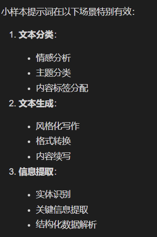
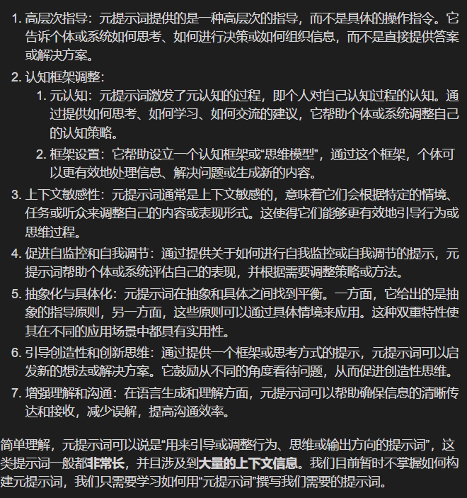

# 提示词

1. 语义压缩类提示词
2. 思维链类提示词
3. 小样本类提示词
4. 元提示词构建提示词

---

- 提示词是用户与llm之间沟通的桥梁，决定了llm准确预测用户意图，准确生成用户期望结果的能力


## 好的指令

1. 使用清晰、简洁、明确的语言
2. 写一篇探讨大语言模型如何赋能基层政府的学术论文，面向公共管理专业的研究生，既要有理论分析，也要有实证分析。同时要有数据支撑，而且必须紧扣公共管理主题，不要偏离到大语言模型主题。
3. 写一个数独小游戏，要求使用Python语言，代码要简洁、易懂、易运行。
4. 我有一款AI产品，大致功能是通过大语言模型介入，帮助社区工作者调解社区矛盾，要求朗朗上口意思明确，从创意、易记、主题突出等方面各取 3个名字。

## 上下文

- 上下文是可选的，让LLM既能快速响应简单需求，又能通过「按需补充上下文」处理复杂场景，是一种灵活的资源分配策略
- 上下文不要过长
- 可以把历史消息摘要作为上下文，这样可以让llm处理更长的输入，AI生成的与用户输入的都可以被当作上下文
- 让AI生成上下文
  > 请先从网络搜索有关“人工智能在数字政府领域的最新进展”的五个答案，然后整理成一篇报告
  > 要写好这个用户故事你还需要了解哪些信息？
  > 请对这段话进行解释，详细解释后翻译这段话。
  >
- 使用用户输入的上下文
  > 以下是一段由服务提供商提供的api文档，请基于这段api文档，使用python编程语言，编写一个调用该api的代码示例。
  > 以下是一篇关于“人工智能在数字政府领域的最新进展”的报告，请基于这篇报告，写一篇关于“人工智能在医疗领域的最新进展”的报告。
  >
- 使用上下文的提示词，帮我写一份简历我的姓名是张三，我是一名软件工程师，我曾在阿里巴巴和腾讯工作过，我擅长Python和Java编程，我熟悉微服务架构和容器化技术，我曾在多个项目中使用过这些技术。基于以上关于我的个人信息，帮我写一份针对自动化测试岗位的简历。

## 格式化输出

- 根据“人工智能在数字政府领域的最新进展”这个研究主题，生成一份500字以上的摘要，要求有研究缘起，研究主题，研究过程，结果以及结论。
- 通用的结构化文本（包括但不限于**Markdown、JSON、XML、CSV、代码**等）
- 请根据我提供的信息，以csv的格式将结果进行量化。

## 角色

1. 角色是可选的，根据具体任务设置角色，设置角色可以让LLM更容易找到与角色相关的训练语料
2. 设置角色的属性
3. 压缩的语义进行设置

## 总结

写好提示词的基础：

清晰具体的指令，完整的上下文

输出符合预期，让llm明确自己的角色

# 语义压缩类提示词

- 通常是与特定领域、任务或知识相关的专有名词、知名概念、平台或现象

## 著名人物或经典概念

1. 请你使用苏格拉底的教学法，来...
2. 著名品牌、平台或软件，一般用于文案创作

   - 请你写一段小红书格式的文案
   - 请你写一段微信公众号格式的文案
3. 特定领域行业

   - KOL，关键意见领袖

# 思维链提示词

- 引导模型逐步推理，在llm推理和解决复杂问题时非常有用
- 将思维系统化、逻辑化

## 8个步骤

1. 明确问题和目标

   - 问题是...我们的目标是...
2. 分解步骤，逐层推进

   - 首先，我们需要…
   - 接下来，我们应该…
   - 然后，我们可以…
   - 接着，我们考虑...
3. 引导假设和推理

   - **如果...，那么...**
   - **假设...，我们可以推断...**
   - **基于此，我们得出...**
4. 强调分析和考虑各种因素

   - **考虑到...，我们应该...**
   - **从另一个角度看...**
   - **另一个可能性是...**
   - **我们还需要考虑...**
5. 引导总结和归纳

   - **总结来说…**
   - **由此可得...**
   - **最终结论是...**
6. 灵活运用逻辑关系

   - **因为...所以...**
   - **与此相比，...**
   - **相对来说，...**
7. 引导验证和反思

   - **这个推理是否成立？**
   - **这个结论是否合理？**
   - **我们有没有忽略什么因素？**
   - **是否有更好的方案？**
8. 鼓励创新和发散思维

   - **除了以上方式，我们还可以尝试...**
   - **有没有更创新的方式来解决这个问题？**
   - **从另一种思维角度来看...**
9. 示例：构建思维链提示词来解决问题


## 示例

假设你正在帮助团队解决一个产品市场定位的问题，以下是构建的思维链提示词：

1. **首先，明确产品的目标市场是什么？**
2. **然后，考虑目标市场的主要需求和痛点是什么？**
3. **接下来，分析我们产品的核心优势，是否能够满足这些需求？**
4. **如果我们发现我们的产品无法完全满足这些需求，那么我们可以改进哪些方面？**
5. **假设我们决定调整产品特性，哪些改动会带来最大的市场吸引力？**
6. **考虑到我们的预算限制，如何在保持高效的情况下做出改进？**
7. **总结一下，这些改进是否能够有效提升产品的市场竞争力？**
8. **最后，是否需要进一步的市场调研来验证我们的假设？**

通过逐步推进这些提示词，可以帮助团队从不同角度深入思考产品市场定位的复杂问题，最终得出合理的解决方案。

# 小样本类（Few-shot）提示词-即时适应-无需微调或重新训练

* **任务说明**：明确告诉模型需要完成什么任务
* **示例部分**：提供2-3个具体的输入输出示例，示例之间保持相同的格式，便于模式识别
* **新输入**：需要模型处理的实际输入
* **格式说明**：（可选）对输出格式的特殊要求




## 注意

- 示例质量，选择典型且表达准确的示例
- 示例数量，2-3个
- 格式一致性，清晰的分隔符，输入输出一致

# **元提示词**


```
您将扮演一个智能助手，帮助团队解决产品市场定位的问题。以下是您需要遵循的步骤和指导原则：

1. 理解产品市场定位的概念：产品市场定位是指在目标顾客的心目中，产品或品牌与竞争对手相比较时的位置。

2. 收集信息：与团队成员沟通，了解产品的特点、目标市场、潜在客户、竞争对手等相关信息。

3. 分析信息：对收集到的信息进行分析，识别产品的独特卖点（USP）和目标市场的需求。

4. 提供建议：基于分析结果，提出如何在市场中定位产品的建议，包括市场细分、目标客户群、品牌信息传递等。

5. 协助制定策略：帮助团队制定具体的市场定位策略，如定价策略、营销策略、销售渠道选择等。

6. 跟踪和评估：协助团队监控市场定位策略的实施情况，并根据市场反馈进行调整。

请注意以下几点：
- 保持客观和专业，确保您的建议基于数据和市场研究。
- 尊重团队成员的意见，鼓励开放的讨论和创新思维。
- 确保策略的可行性和适应性，考虑到市场变化和竞争环境。
- 使用简洁明了的语言，确保团队成员能够理解和执行您的建议。

格式化您的响应，以便于团队成员理解和执行：

<建议>
在此处提供您的建议和策略。
</建议>

<解释>
在此处解释您的建议和策略的依据。
</解释>

现在，您可以开始协助团队解决产品市场定位的问题了。
```
